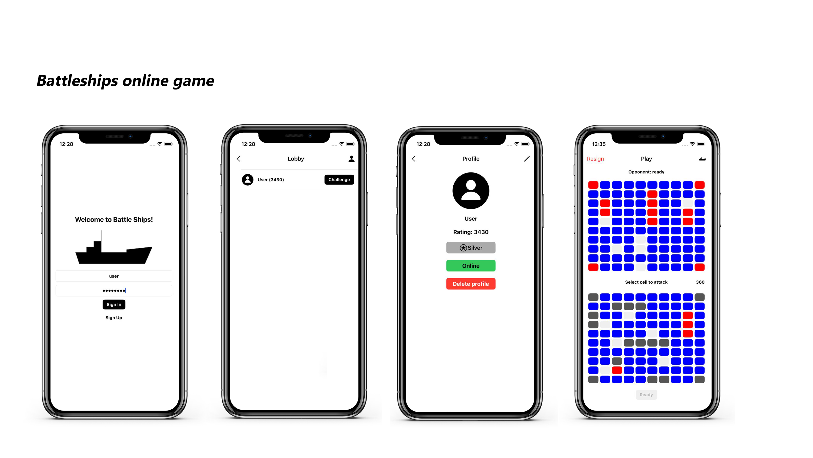

# Battleships

## Implementation of the board game "Sea Battle"

## Technology Stack:
* Realm Swift SDK
* UIKit
* Foundation
* MongoDB Atlas Device Sync

## Features
* Login/Registration
* Rating System
* Online Lobby
* Challenge System (sending challenges to other players)
* Profile Customization
* "Sea Battle" Rules

## Architecture Components
* VIPER Pattern (Presentation)
* Delegation Pattern (Some custom views)

## Results:

